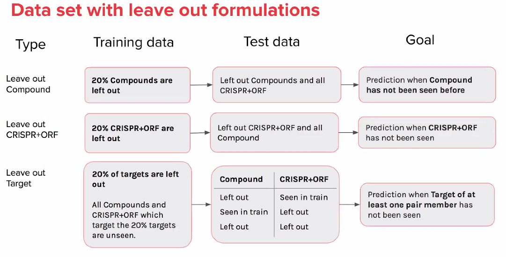

# Setup

```{r message=FALSE}
library(glue)
library(magrittr)
library(tidyverse)
source("utils.R")
```

# Read data

@danieljmichael said:

All of the possible splits we consider are in the `splits/` directory.

The naming convention I use is `{formulation}__{features}__{train|val|test}.csv`.

So as an example, `compound__crispr_orf__test.csv` contains the test set for the leave out compound split with CRISPR+ORF features.

The binary_predictions directory contains the binary predictions and predicted probabilities for each sample in the test set for each possible split (except for `naive__crispr` and `naive__orf` since I haven't fine-tuned the hyperparameters for these yet).



```{r}
classifier <- params$classifier
formulation <- params$formulation
features <- params$features
```

Create `pert_iname` and `gene` lookup table (because `gene` is missing in the splits data frames)

```{r}
updated_connections <- 
  read_csv("../0.inspect-metadata/output/JUMP-Target_compounds_crispr_orf_connections.csv",
           col_types = cols())

gene_lookup_orf <- 
  updated_connections %>% 
  distinct(broad_sample_orf, gene)

gene_lookup_crispr <- 
  updated_connections %>% 
  distinct(broad_sample_crispr, gene)

compound_lookup <- 
  updated_connections %>% 
  distinct(pert_id_compound, pert_iname_compound)
```

Verify that the list of genes in the two gene lookup tables are identical

```{r}
all.equal(
  gene_lookup_orf %>% distinct(gene) %>% arrange(gene),
  gene_lookup_crispr %>% distinct(gene) %>% arrange(gene)
)
```

Specify lookup table to be used. Use ORF lookup by default.

```{r}
gene_lookup <- gene_lookup_orf

if (params$features == "crispr") {
  gene_lookup <- gene_lookup_crispr
} 
```

Get data splits

```{r}
data_splits <-
  c("train", "test", "val") %>%
  rlang::set_names() %>%
  map(function(split_set_i) {
    read_csv(
      glue(
        "../1.analysis/splits2/{formulation}__{features}__{split_set_i}.csv"
      ),
      col_types = cols()
    ) %>%
      mutate(Metadata_split_set = split_set_i) %>%
      process_metadata() %>%
      mutate(is_connected = y == 1) %>%
      select(-y) %>%
      inner_join(gene_lookup) %>%
      inner_join(compound_lookup)
      
  })
```

# Inspect splits

## Connections

```{r}
data_splits %>%
  bind_rows() %>%
  group_by(split_set, is_connected) %>%
  tally()
```

Number of connections in total

```{r}
data_splits %>%
  bind_rows() %>%
  count(name = "n_all")
```

Number of connections in total, across data splits (this should be the same as above)

```{r}
n_all <- 
  data_splits %>%
  bind_rows() %>%
  select(-split_set, -is_connected, -broad_sample_compound) %>%
  distinct() %>%
  count(name = "n_all")

n_all
```

Number of connections in total, only TRUE connections

```{r}
curcon <- 
  data_splits %>%
  bind_rows() %>%
  select(-split_set, -broad_sample_compound) %>%
  filter(is_connected) %>%
  distinct() %>%
  select(pert_id_compound, 
         matches("broad_sample_orf|broad_sample_crispr"), 
         is_connected, pert_iname_compound, gene)

n_all_connected <- 
  curcon %>%
  count(name = "n_all_connected")

n_all_connected
```

Now consider only the distinct gene-compound connections

```{r}
gene_compound <-  
  data_splits %>%
  bind_rows() %>%
  distinct(pert_iname_compound, gene, split_set, is_connected)
```

Number of connections in total

```{r}
n_gene_compound <- 
  gene_compound %>%
  count(name = "n_gene_compound")

n_gene_compound
```

Number of connections in total

```{r}
n_gene_compound_across_splits <- 
  gene_compound %>%
  distinct(pert_iname_compound, gene, is_connected) %>%
  count(name = "n_gene_compound_across_splits")

n_gene_compound_across_splits
```

This should be equal to number of genes x number of compounds

```{r}
tibble(n_genes_x_compounds = 160 * 302)
```

How many of these are connected? If the splits overlap, this number will be 
higher than the actual number of true connections.

```{r}
n_gene_compound_connected <- 
  gene_compound %>%
  filter(is_connected) %>%
  count(name = "n_gene_compound_connected")

n_gene_compound_connected
```

Ignore splits and recompute

```{r}
n_gene_compound_across_splits_connected <- 
  gene_compound %>%
  filter(is_connected) %>%
  distinct(pert_iname_compound, gene) %>%
  count(name = "n_gene_compound_across_splits_connected")

n_gene_compound_across_splits_connected
```

## Leakage

How many compounds involved total?

```{r}
n_compounds <- 
  gene_compound %>%
  distinct(pert_iname_compound) %>%
  count(name = "n_compounds")

n_compounds
```

How many compounds involved in connections?

```{r}
n_connected_compounds <- 
  gene_compound %>%
  filter(is_connected) %>%
  distinct(pert_iname_compound) %>%
  count(name = "n_connected_compounds")

n_connected_compounds
```

How many genes involved in total?

```{r}
n_genes <- 
  gene_compound %>%
  distinct(gene) %>%
  count(name = "n_genes")

n_genes
```

How many genes involved in connections?

```{r}
n_connected_genes <- 
  gene_compound %>%
  filter(is_connected) %>%
  distinct(gene) %>%
  count(name = "n_connected_genes")

n_connected_genes
```

**Note:** In the checks below, we allow a data point to be present in validation and test.

### Gene-compound

How many times is a gene-compound pair present in train and test?

```{r}
gene_compound_splits <- 
  gene_compound %>% 
  group_by(pert_iname_compound, gene, is_connected, split_set) %>% 
  tally() %>% 
  pivot_wider(names_from = "split_set", values_from = "n", values_fill = 0) %>% 
  arrange(train, test, val) %>%
  rename(connected = is_connected) %>%
  mutate(leak = factor(train > 0 & test > 0, c(FALSE, TRUE)))
#  mutate(leak = factor((val > 0 | train > 0) & test > 0, c(FALSE, TRUE)))

n_leak_gene_compound <- 
  gene_compound_splits %>%
  group_by(connected, leak, .drop = FALSE) %>%
  tally()

n_leak_gene_compound

n_leak_gene_compound_wide <- 
  n_leak_gene_compound %>% 
  mutate(connected = paste("connected", connected, sep = "_")) %>%
  mutate(leak = paste("leak", leak, sep = "_")) %>%
  unite("connected_leak", all_of(c("connected", "leak")), sep = "_") %>%
  pivot_wider(names_from = "connected_leak", 
              values_from = "n", 
              names_prefix = "n_gene_compound_")
```

### Compound

How many times is a compound present in train and test?

```{r}
compound_splits <- 
  gene_compound %>% 
  group_by(pert_iname_compound, is_connected, split_set) %>% 
  tally() %>% 
  pivot_wider(names_from = "split_set", values_from = "n", values_fill = 0) %>% 
  arrange(train, test, val) %>%
  rename(connected = is_connected) %>%
  mutate(leak = factor(train > 0 & test > 0, c(FALSE, TRUE)))
#  mutate(leak = factor((val > 0 | train > 0) & test > 0, c(FALSE, TRUE)))

n_leak_compound <- 
  compound_splits %>%
  group_by(connected, leak, .drop = FALSE) %>%
  tally()

n_leak_compound

n_leak_compound_wide <- 
  n_leak_compound %>% 
  mutate(connected = paste("connected", connected, sep = "_")) %>%
  mutate(leak = paste("leak", leak, sep = "_")) %>%
  unite("connected_leak", all_of(c("connected", "leak")), sep = "_") %>%
  pivot_wider(names_from = "connected_leak", 
              values_from = "n", 
              names_prefix = "n_compound_")
```

### Gene

How many times is a gene present in train and test?

```{r}
gene_splits <- 
  gene_compound %>% 
  group_by(gene, is_connected, split_set) %>% 
  tally() %>% 
  pivot_wider(names_from = "split_set", values_from = "n", values_fill = 0) %>% 
  arrange(train, test, val) %>%
  rename(connected = is_connected) %>%
  mutate(leak = factor(train > 0 & test > 0, c(FALSE, TRUE)))
#  mutate(leak = factor((val > 0 | train > 0) & test > 0, c(FALSE, TRUE)))

n_leak_gene <- 
  gene_splits %>%
  group_by(connected, leak, .drop = FALSE) %>%
  tally()

n_leak_gene

n_leak_gene_wide <- 
  n_leak_gene %>% 
  mutate(connected = paste("connected", connected, sep = "_")) %>%
  mutate(leak = paste("leak", leak, sep = "_")) %>%
  unite("connected_leak", all_of(c("connected", "leak")), sep = "_") %>%
  pivot_wider(names_from = "connected_leak", 
              values_from = "n", 
              names_prefix = "n_gene_")
```

# Save 

## Save splits with gene-compound annotations

```{r}
gene_compound %>%
  write_csv(glue("output/splits__{formulation}__{features}.csv.gz"))
```

## Save split inspections

```{r}
splits_report <- 
  bind_cols(
  n_all,
  n_all_connected,
  n_gene_compound,
  n_gene_compound_across_splits,
  n_gene_compound_connected,
  n_gene_compound_across_splits_connected,
  n_compounds,
  n_connected_compounds,
  n_genes,
  n_connected_genes,
  n_leak_gene_compound_wide,
  n_leak_gene_wide,
  n_leak_compound_wide
) %>% 
  pivot_longer(
    everything(), 
    names_to = "count", 
    values_to = as.character(glue("{formulation}__{features}"))
    ) 

splits_report

splits_report %>%
  write_csv(glue("output/splits_report__{formulation}__{features}.csv"))
```

Save as a matrix that can be loaded in https://software.broadinstitute.org/morpheus/

| Is connected | In training set | `connected_train` value |
| :----------- | :-------------- | :---------------------- | 
| False        | False           | 0                       |
| False        | True            | 1                       |
| True         | False           | 2                       |
| True         | True            | 3                       |

```{r}
gene_compound_matrix_long <- 
  gene_compound_splits %>% 
  ungroup() %>%
  select(pert_iname_compound, gene, connected, train) %>% 
  mutate(connected_train = 2 * connected + (train > 0)) %>% 
  arrange(pert_iname_compound, gene)

gene_compound_matrix <- 
  gene_compound_matrix_long  %>%
  select(-connected, -train) %>%
  pivot_wider(names_from = "gene", values_from = "connected_train")

gene_compound_matrix %>%
  write_tsv(glue("output/gene_compound_matrix__{formulation}__{features}.tsv"))
```


```{r}
plot_gene_compound_matrix <-
  function(x_gene_compound_matrix_long,
           show_train_test = TRUE,
           show_borders = FALSE) {
    p <-
      x_gene_compound_matrix_long %>%
      ggplot(aes(
        pert_iname_compound,
        gene,
        fill = connected,
        alpha = train == 1
      )) +
      scale_fill_manual(values = c("#b2df8a", "#1f78b4"), guide = FALSE)
    
    if (show_train_test) {
      p <- p +
        scale_alpha_manual(values = c(0.7, 1), guide = FALSE)
    } else {
      p <- p +
        scale_alpha_manual(values = c(1, 1), guide = FALSE)
    }
    
    if (show_borders) {
      p <- p +
        geom_tile(color = "#ffffff")
    } else {
      p <- p +
        geom_tile()
      
    }
    
    p <- p +
      theme_void() +
      coord_equal()
    
    p
  }
```


```{r}
p <- 
  gene_compound_matrix_long %>%
  plot_gene_compound_matrix(show_train_test = TRUE)

ggsave(glue("output/gene_compound_matrix__{formulation}__{features}.png"), 
       p, height = 4)

p <- 
  gene_compound_matrix_long %>%
  plot_gene_compound_matrix(show_train_test = FALSE)

ggsave(glue("output/gene_compound_matrix__{formulation}__{features}_notraintest.png"), 
       p, height = 4)

```


```{r}
set.seed(42)

pert_iname_compound_subset <- 
  gene_compound_matrix_long %>%
  distinct(pert_iname_compound) %>%
  sample_frac(.2)

gene_subset <- 
  gene_compound_matrix_long %>%
  distinct(gene) %>%
  sample_frac(.2)
```


```{r}
p <- 
  gene_compound_matrix_long %>% 
  inner_join(pert_iname_compound_subset) %>%
  inner_join(gene_subset) %>%
  plot_gene_compound_matrix(show_train_test = TRUE, show_borders = TRUE)

ggsave(glue("output/gene_compound_matrix_sampled__{formulation}__{features}.png"), 
       p, height = 4)

p <- 
  gene_compound_matrix_long %>% 
  inner_join(pert_iname_compound_subset) %>%
  inner_join(gene_subset) %>%
  plot_gene_compound_matrix(show_train_test = FALSE, show_borders = TRUE)

ggsave(glue("output/gene_compound_matrix_sampled__{formulation}__{features}_notraintest.png"), 
       p, height = 4)

```

# Inspect predictions

```{r}
prediction_df <-
  read_csv(
    glue("../1.analysis/final_binary_predictions/{classifier}__{formulation}__{features}.csv"), 
    col_types = cols()) %>%
  process_metadata()
```

Verify that the predictions are made on the test set

```{r}
test_diff_pred <-
  anti_join(data_splits$test %>% select(matches("^broad_sample")), 
          prediction_df %>% select(matches("^broad_sample")))

pred_diff_test <-
  anti_join(prediction_df %>% select(matches("^broad_sample")),
          data_splits$test %>% select(matches("^broad_sample")))
```
```{r}
n_test_diff_pred <- 
  count(test_diff_pred, name = "n_test_diff_pred")

n_pred_diff_test <- 
  count(pred_diff_test, name = "n_pred_diff_test")

n_test_diff_pred

n_pred_diff_test
```

```{r}
slice_sample(test_diff_pred, n = 10)

slice_sample(pred_diff_test, n = 10)
```

```{r}
predictions_report <- 
  bind_cols(
  n_test_diff_pred,
  n_pred_diff_test) %>% 
  pivot_longer(
    everything(), 
    names_to = "count", 
    values_to = as.character(glue("{formulation}__{features}"))
    )   

predictions_report %>%
  write_csv(glue("output/predictions_report__{formulation}__{features}.csv"))
```

